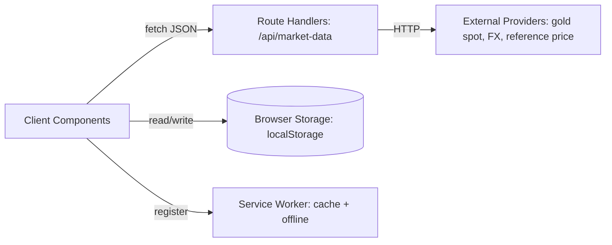

# Architecture Spine — Sri Lanka Gold Value PWA

## Design Paradigm

Layered PWA: **server route handlers** (`app/api/*`) are the only code allowed to talk to third-party services; **client components** own presentation, calculation display, and all local persistence. Nothing else may cross that boundary in either direction.



## Invariants & Rules

### AD-1 — Server/client I/O boundary [ADOPTED]

- **Binds:** all
- **Prevents:** a third-party API key or vendor call ending up in client bundle code.
- **Rule:** only files under `app/api/**` may hold provider credentials or call external HTTP endpoints. Client components consume only the app's own `/api/market-data` shape.

### AD-2 — Market-data provider adapter

- **Binds:** FR1
- **Prevents:** vendor lock-in hardcoded in more than one place; swapping a provider later touching client code.
- **Rule:** all external price/FX fetching goes through a `MarketDataProvider` interface (`getSpotGoldUsd()`, `getUsdLkrRate()`, `getReferencePrice()`); concrete implementations are injected in one place in the route handler.

### AD-3 — No backend store [ADOPTED]

- **Binds:** FR8–FR11 (My Gold), FR19 (Settings), FR12–FR13 (Price History)
- **Prevents:** two features inventing incompatible persistence schemes, or a partial backend creeping in.
- **Rule:** all user-generated state lives in browser storage under one namespaced root key (`goldpwa.v1`). No server-side database in v1.

### AD-4 — Client-captured history, no backfill

- **Binds:** FR12–FR13
- **Prevents:** a future implementer wiring a server-side history table, contradicting AD-3.
- **Rule:** a price snapshot is appended to a capped local ring buffer at most once per configured refresh interval, on app foreground. No server history endpoint; no backfill before first use.

### AD-5 — Honest unavailability

- **Binds:** FR1, NFR2
- **Prevents:** silently guessing or defaulting a price when no real data is available.
- **Rule:** `/api/market-data` always returns an explicit `status: "fresh" | "stale-cache" | "unavailable"` field. The client renders the PRD's stale/offline treatment for anything but `"fresh"`, and never invents a number for `"unavailable"`.

### AD-6 — Permission-at-point-of-value

- **Binds:** FR14, FR16
- **Prevents:** a service worker auto-subscribing to push at install time, contradicting the UX's benefit-first permission flow.
- **Rule:** push subscription creation is triggered only from the alert-editor / daily-digest save action, never from service-worker install or app boot.

## Consistency Conventions

| Concern | Convention |
| --- | --- |
| Data & formats | Monetary values as numbers in the smallest display unit (LKR, not cents); timestamps as ISO 8601 UTC strings; IDs as `crypto.randomUUID()` |
| State & storage | Single root key `goldpwa.v1` in `localStorage`, one sub-object per domain (`holdings`, `settings`, `alerts`, `history`) |
| Errors | API route errors return `{ status: "unavailable", reason: string }` — never an HTTP 500 with no body the client can react to |

## Stack

| Name | Version |
| --- | --- |
| Next.js (App Router) | latest, resolved via `create-next-app` at scaffold time |
| TypeScript | latest, bundled with the Next.js starter |
| Tailwind CSS | latest, bundled with the Next.js starter |
| React | latest, bundled with the Next.js starter |

## Structural Seed

```text
{root}/
  app/
    page.tsx                # Home
    calculator/page.tsx
    my-gold/page.tsx
    history/page.tsx
    settings/page.tsx
    api/market-data/route.ts  # only place external providers are called
  lib/
    market-data/             # MarketDataProvider interface + implementations
    gold-math.ts             # conversion + calculation functions (AD from PRD NFR1)
    storage.ts                # localStorage read/write helpers, namespaced under goldpwa.v1
  components/
    price-hero.tsx
    verification-banner.tsx
    calculator-form.tsx
    holding-row.tsx
    history-chart.tsx
  public/
    manifest.json
    sw.js
```

## Capability → Architecture Map

| Capability / Area | Lives in | Governed by |
| --- | --- | --- |
| Market data fetch (FR1) | `app/api/market-data/route.ts`, `lib/market-data/` | AD-1, AD-2, AD-5 |
| Calculator (FR2–FR3) | `app/calculator/`, `lib/gold-math.ts` | NFR1 (exact conversion constants) |
| Trust & Verification (FR5–FR7) | `components/verification-banner.tsx` | AD-2 (reference price is a provider too) |
| My Gold (FR8–FR11) | `app/my-gold/`, `lib/storage.ts` | AD-3 |
| Price History (FR12–FR13) | `app/history/`, `lib/storage.ts` | AD-3, AD-4 |
| Engagement/Notifications (FR14–FR16) | `app/settings/`, `public/sw.js` | AD-6 |
| PWA/Offline (FR17–FR18) | `public/manifest.json`, `public/sw.js` | AD-5 |

## Deferred

- **Concrete gold-spot and FX vendor selection** (PRD §6 Open Questions) — `MarketDataProvider` (AD-2) makes this a swap-in, not an architecture change. The demo build ships a sample/fallback implementation.
- **Concrete local reference-price source** (PRD FR5/FR6) — same adapter boundary; a named source can be slotted in later.
- **Bullion certification/premium handling** — out of the current FR set (PRD §6); no architectural hook needed until it's scoped.
- **Deployment/hosting target** — not yet chosen; the Next.js output is deployable to any Node-compatible host or Vercel without changes to the invariants above.
